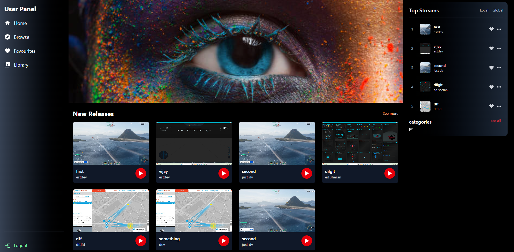
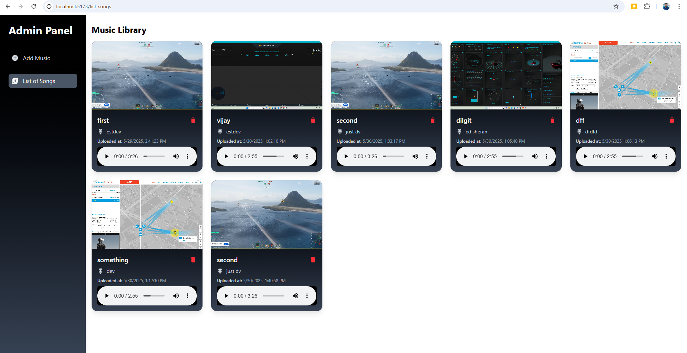

# Music Streaming Application

A full-stack MERN application with separate admin and user interfaces for music management and streaming.




## Project Overview
This application consists of two main interfaces:
1. **User Panel**: Allows users to browse and stream music
2. **Admin Panel**: Provides tools for managing music content and users

## Key Features

### User Panel Features
- Music browsing and streaming
- Search functionality
- Playlist creation
- User profile management

### Admin Panel Features
- Music upload and management
- User management
- Analytics dashboard
- Content moderation tools

## Navigation Between Panels
1. **Accessing Admin Panel**:
   - Navigate to `/add-music` route
            (or)
         login with
     email:admin@gmail.com
     password:admin

2. **Returning to User Panel**:
   - Click "User View" in admin navigation
   - Or navigate to root URL `/`

## Technologies
- **Frontend**: React, Vite, Tailwind CSS
- **Backend**: Node.js, Express
- **Database**: MongoDB
- **Authentication**: JWT
- **File Storage**: Local file system

## Installation

### Backend Setup
1. Navigate to backend directory:
```bash
cd backend

add .env file with
PORT=5000
MONGO_URI=your_mongodb_uri
JWT_SECRET=your_jwt_secret
npm install
node server.js    
```

2.navigate to frontend directory:
```bash
cd frontend
npm install
npm run dev
```   